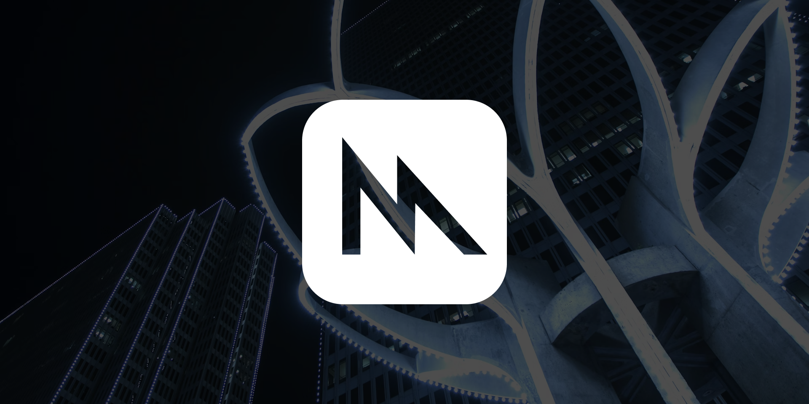
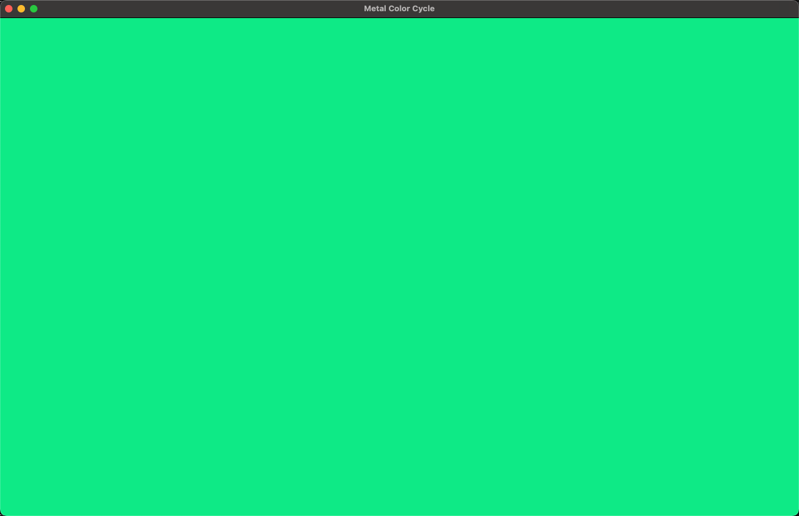
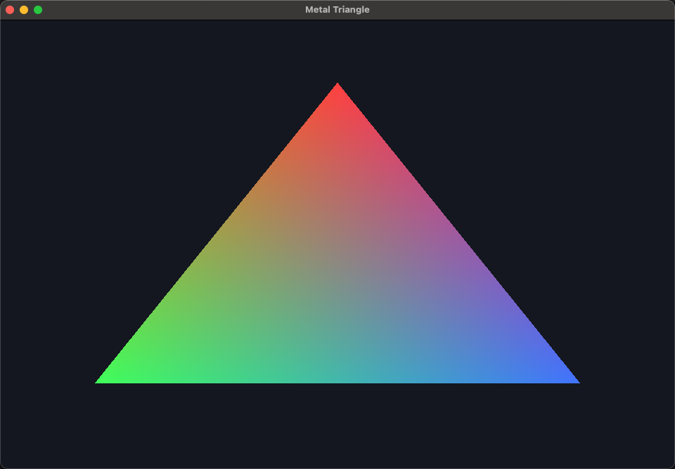
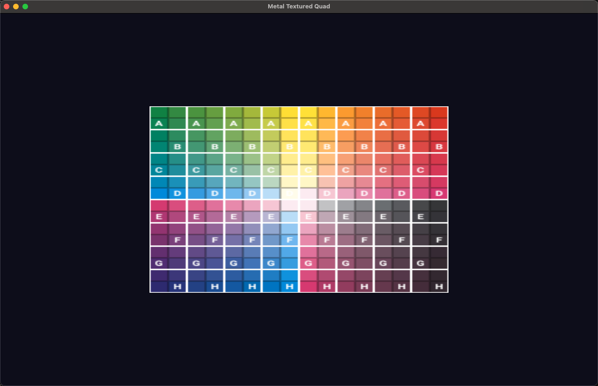
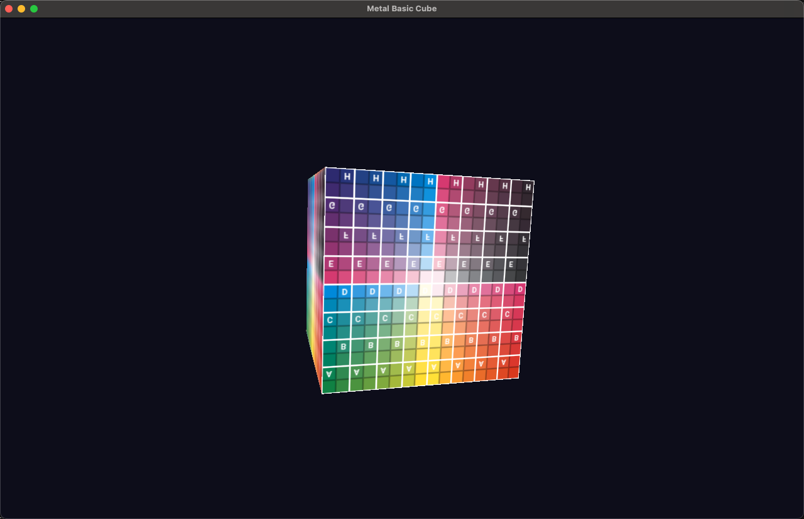
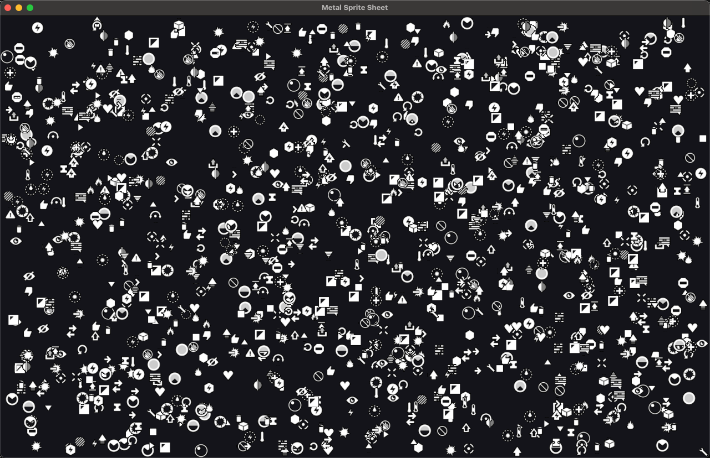
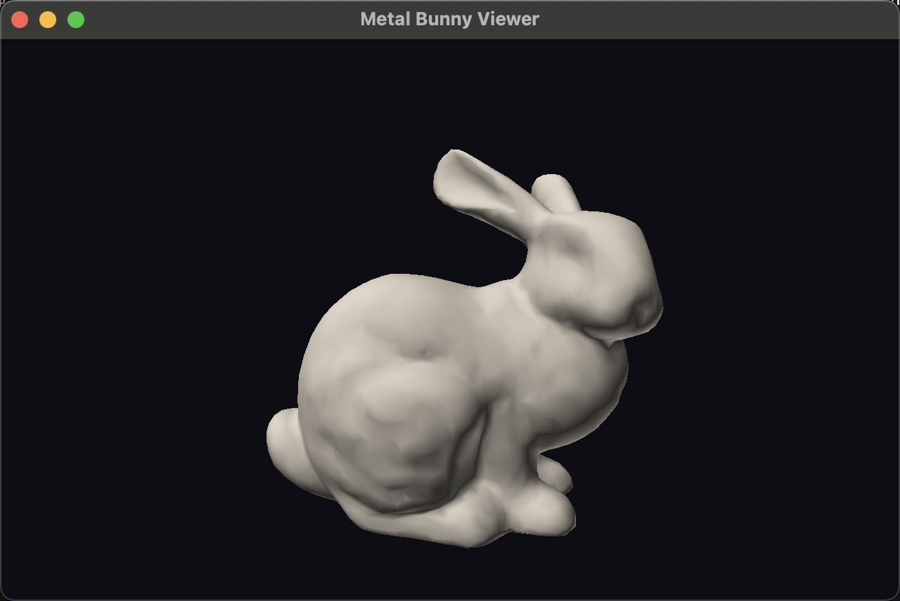

# metal4 - Metal 4 bindings for Nim.

`nimby install metal4`


[API reference](https://treeform.github.io/metal4)

## About

`metal4` is a macOS-focused Metal wrapper for Nim. It vendors a selected set of
Apple SDK `.h` files, parses the Objective-C API surface needed by the examples
in this repository, generates low-level Nim bindings from that parsed data, and
adds a small UFCS-friendly facade on top.

The generated layer covers the core constants, structs, handles, properties,
and selector-based methods used to set up a Metal device, build pipelines,
upload textures, encode render passes, and present through `CAMetalLayer`.

The package is designed to feel close to Apple's Metal API while still fitting
Nim's explicit, data-oriented style. A small hand-written layer in
`src/metal4/extras.nim` and `src/metal4/context.nim` provides the ergonomic
pieces that are awkward to derive mechanically from Objective-C headers alone.

> **AI disclaimer: Much of this library was AI generated.**

## Documentation

API docs are generated from `src/metal4.nim` by `.github/workflows/docs.yml`.

## Examples

The `examples/` directory contains six working Metal applications that exercise
different parts of the generated API:

| Example | What it tests |
|---------|--------------|
| `basic_screen` | Device init, drawable acquisition, clear color, present |
| `basic_triangle` | Shader compilation, render pipeline setup, vertex data, draw calls |
| `basic_quad` | Texture loading, texture upload, sampler state, textured rendering |
| `basic_cube` | 3D transforms, depth buffer, mip-mapped textures, camera motion |
| `sprite_sheet` | Sprite batching, animated atlas sampling, instanced drawing |
| `viewer_obj` | OBJ mesh loading, indexed rendering, depth testing, simple lighting |

These examples act as integration tests for the generated bindings. When the
header parser or code generator changes, rebuilding and running the examples
verifies that the generated selectors, type mappings, and property wrappers
still match the actual Metal API.

### `basic_screen`



### `basic_triangle`



### `basic_quad`



### `basic_cube`



### `sprite_sheet`



### `viewer_obj`



## How the API Is Generated

The Nim bindings are not written by hand. They are produced from vendored Apple
framework headers through a small parsing and generation pipeline. Since Metal
is exposed as Objective-C API rather than as a more structured IDL-like or xml format,
the toolchain is intentionally narrow and explicit: it only extracts the parts
of the SDK surface that this package currently needs.

### Step 1: Downloading Apple SDK Headers

The first tool snapshots the selected Metal and QuartzCore headers from the
active macOS SDK:

```text
nim r tools/download_headers.nim
```

This uses `xcrun --sdk macosx --show-sdk-path` unless `METAL4_SDK_PATH` is set,
then copies the chosen headers into the repo under `headers/`.

The current vendored set includes:

| Framework | Headers |
|-----------|---------|
| `Metal.framework` | `Metal.h`, `MTLDevice.h`, `MTLBuffer.h`, `MTLTexture.h`, `MTLRenderPipeline.h`, `MTLRenderPass.h`, `MTLRenderCommandEncoder.h`, `MTLCommandBuffer.h`, `MTLCommandQueue.h`, `MTLCommandEncoder.h`, `MTLSampler.h`, `MTLDepthStencil.h`, `MTLDrawable.h`, `MTLTypes.h`, `MTLPixelFormat.h`, `MTLAllocation.h`, `MTLFunctionDescriptor.h`, `MTLLibrary.h` |
| `QuartzCore.framework` | `CAMetalLayer.h` |

The tool also writes `headers/manifest.json` so the repo records which SDK path
the headers came from and when they were vendored.

### Step 2: Parsing the Headers into IR

The parser reads the vendored headers and converts them into an intermediate
representation:

```text
nim r tools/parse_headers.nim
```

This produces `headers/ir.json`, a snapshot of the extracted API surface. The
parser focuses on the Objective-C and C constructs that matter for Metal:

- enums and option sets
- structs such as `MTLClearColor`, `MTLSize`, and `MTLViewport`
- Objective-C handles and inheritance
- properties such as `CAMetalLayer.device`
- selector-bearing methods such as `newCommandQueue` and `drawPrimitives`
- aliases and plain C functions such as `MTLCreateSystemDefaultDevice`

The parser logic lives in `tools/metal4_parser.nim`, and the typed IR
definitions live in `tools/metal4_ir.nim`.

### Step 3: Generating Nim Bindings

The generator reads the parsed headers and emits the package's low-level Nim
surface:

```text
nim r tools/generate_api.nim
```

It writes these modules:

| File | Purpose |
|------|---------|
| `src/metal4/constants.nim` | Generated constants for enum members and API values |
| `src/metal4/types.nim` | Generated struct and handle type declarations |
| `src/metal4/functions.nim` | Generated plain C entry points |
| `src/metal4/protocols.nim` | Generated Objective-C methods and properties |
| `src/metal4.nim` | The umbrella module that re-exports the generated and hand-written layers |

The generator is intentionally selective. Rather than dumping the entire Apple
SDK into Nim, it targets the enums, structs, handles, properties, and methods
listed in `tools/generate_api.nim`. This keeps the output explicit and easier
to validate while the binding surface is still growing.

### Step 4: Hand-Written Runtime and Helpers

Some pieces are easier and safer to maintain by hand. These live in normal Nim
modules rather than in generated output:

| File | Purpose |
|------|---------|
| `src/metal4/codes.nim` | Error types, nil checks, and `NSError` helpers |
| `src/metal4/runtime.nim` | Objective-C runtime imports and framework linkage |
| `src/metal4/extras.nim` | Small ergonomic helpers around generated Objective-C bindings |
| `src/metal4/context.nim` | `Windy` + `CAMetalLayer` setup used by the examples |

This split keeps the generated layer mechanically reproducible while still
offering a small practical API for examples and day-to-day use.

### Summary of the Pipeline

```text
Apple macOS SDK
        |
        v
tools/download_headers.nim     -- snapshots selected .h files into headers/
        |
        v
tools/metal4_parser.nim        -- parses Objective-C and C declarations
tools/metal4_ir.nim            -- intermediate representation types
        |
        v
tools/parse_headers.nim        -- writes headers/ir.json
        |
        v
tools/generate_api.nim         -- emits generated Nim modules
        |
        v
src/metal4/constants.nim
src/metal4/types.nim
src/metal4/functions.nim
src/metal4/protocols.nim       -- generated layer
        |
src/metal4/codes.nim
src/metal4/runtime.nim
src/metal4/extras.nim
src/metal4/context.nim         -- hand-written layer
        |
        v
src/metal4.nim                 -- public umbrella module
        |
        v
examples/*.nim                 -- working Metal applications and integration tests
```

## Workflow

Regenerate the bindings and run the smoke tests with:

```text
nim r tools/download_headers.nim
nim r tools/parse_headers.nim
nim r tools/generate_api.nim
nim check tests/tests.nim
nim r tests/tests.nim
```

## Notes

- This project is intended to build and test on macOS.
- The package surface is `import metal4` and `import metal4/context`.
- `headers/` contains vendored Apple framework headers plus `manifest.json` and
  the parsed `ir.json` snapshot.
- `tools/` contains the header download, parsing, generation, inspection, and
  screenshot capture utilities.
